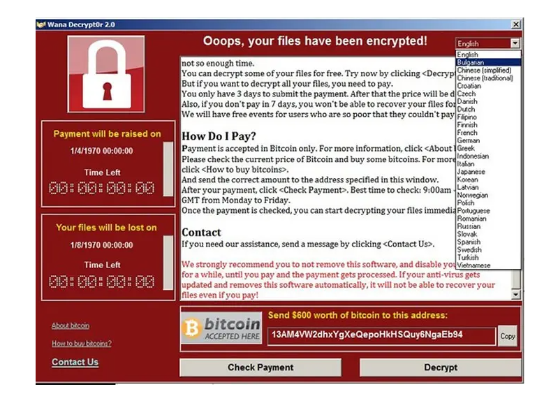
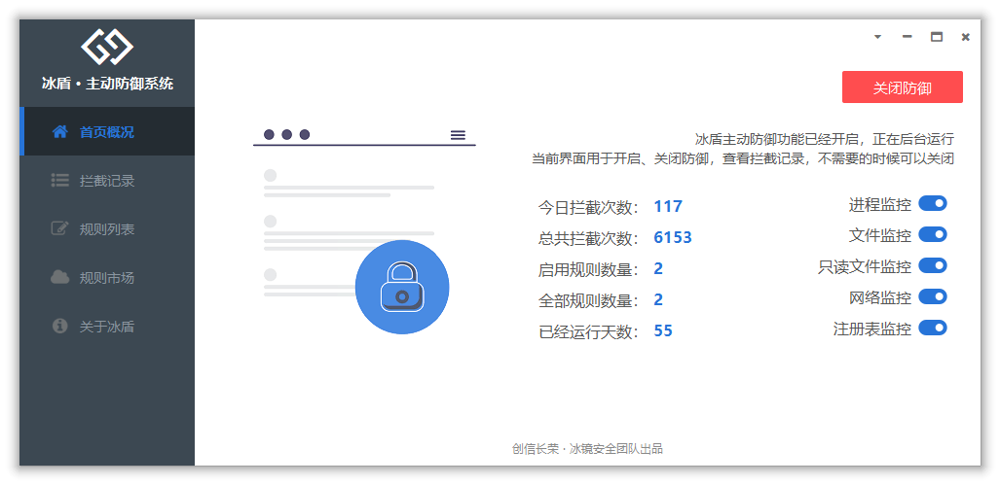
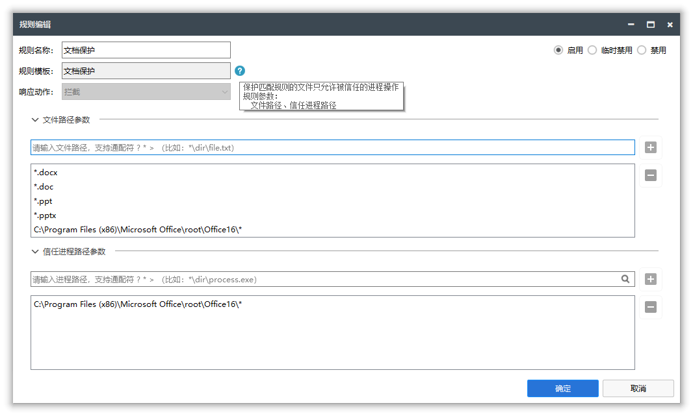

## 什么是勒索病毒

勒索病毒是一种通过加密被感染者计算机上面的文件，并施于敲诈勒索的恶意程序。

勒索病毒会导致严重的数据安全问题，让企业、个人的核心数据资产被完全加密，从而影响正常的生产、或者让一些业务系统完全不可用，间接造成了严重的经济损失。2017年，勒索病毒借助永恒之蓝漏洞，席卷全球，造成全球超过550亿元以上的损失，让无数企业闻风丧胆。

很多安全厂商都马上推出各种针对勒索病毒的专杀工具、防护工具、解密工具，但时至今日，勒索病毒仍然经久不衰。

一些人可能会问，勒索病毒这么厉害，是因为它很复杂，安全厂商没有研究透它吗？

不，事实刚好相反，勒索病毒太过于简单了，简单到谁都可以轻易的实现一个勒索病毒。

勒索病毒完全没有固定的特征，可以使用任何的开发语言实现（最新很多采用了Go、Rust这样的语言开发），或者直接基于PowerShell脚本就可以实现勒索病毒的效果。更甚着，直接通过压缩文件，压缩后删除源文件，也可以实现勒索病毒效果。

勒索病毒大部分使用了非对称加密，即使把源码完全公开，也没有办法还原被加密的文件。正因为如此，网上甚至出现了很多开源勒索病毒，勒索病毒 as Service的概念，勒索病毒完全产业化，在利益驱动下，使得勒索病毒层出不穷。甚至有一些缺乏法律意识的人直接下载开源的勒索病毒，然后采用微信收款来实现勒索病毒的收款。

## 勒索病毒的防护

在目前的安全市场上，针对勒索病毒主要是两个方向的防护：

- 针对勒索病毒的感染渠道来做防护

  - 及时安装补丁
  - 添加防火墙策略
  - 使用零信任网络
  - 增强边界防御

- 针对勒索病毒本身的特点来做防护

  - 杀毒云引擎
    - 依赖海量数据采集能力，可以短时间内捕获到新型的勒索病毒，然后将特征同步给杀毒软件

  - 文档守护者
    - 在用户修改文件的时候，智能备份，在出现数据被加密后，可以通过备份恢复

  - 行为智能提醒 
    - 在发现某些程序频繁操作文件后，弹框提醒让用户确认
  - 添加可信区域
    - 将计算机隔离成可信、不可信两个区域，保证数据只被可信区域的程序访问

## 冰盾 · 主动防御系统

为解决勒索病毒的问题，基于行为防御的冰盾专门针对勒索病毒添加了两个规则模板：

- 文档保护
  - 可以保护匹配规则的文件只被信任的进程操作
- 隐私保护
  - 可以保护匹配规则的文件只被信任的进程读取

只需要简单添加需要保护的文件路径，然后添加允许操作这些文件的进程路径，就可以得到文档保护的目的。

用户可以非常灵活的制定自己针对勒索病毒的防护解决方案，同时不会占用大量系统资源。特别是一些没法实时更新杀毒软件的内网环境、或者是需要长期运行的服务器环境。

**冰盾 · 主动防御系统** 【专业不流氓】是一款为专业人士打造的终端、主机主动防御系统，可以帮助您抵制流氓软件、保护电脑安全、提高工作效率。

除了文档保护、隐私保护，冰盾 · 主动防御系统还有更多不同类型的规则模板，比如进程保护、注册表拦截、网络防护等等。

有需要的可以通过 https://imonitorsdk.com/idefender 下载了解更多。对于企业希望集成防御能力到自己的产品里面的，也可以通过接入iMonitorSDK来实现。
