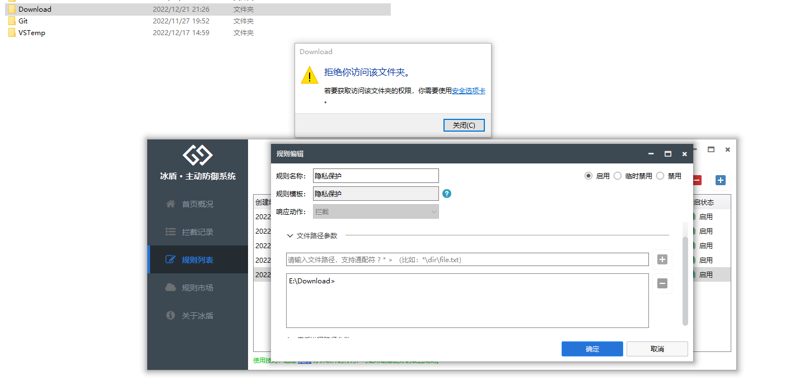

## 使用说明

冰盾是一款基于软件行为规则的防御引擎，规则主要包括基础规则和自定义规则两部分。

### 基础规则

- **智能防护：** 利用智能分析和识别恶意软件行为，提供实时防护机制，确保系统免受恶意软件侵害。
- **系统优化：** 拦截非必要的软件和联网行为，提高系统运行速度和稳定性，提供更优秀的用户体验。
- **安全加固：** 拦截系统存在漏洞的组件和常见入侵途径，增强系统安全性，避免遭受恶意软件攻击。
- **漏洞防御：** 根据已知漏洞入侵方式开发专门的防御规则，保障系统不受黑客攻击和恶意软件入侵。

### 自定义规则

为了更方便地添加自定义规则，冰盾采用模板+参数的方式。使用模板创建规则后，只需添加关键参数即可建立规则。例如，使用进程启动模板时，只需填写需要拦截的进程名称或路径即可。

目前已经支持的规则模板有30多个，未来根据需求还会持续添加。

#### 常见规则模板介绍

##### 禁止进程启动

##### 文档保护

##### 隐私保护

##### 禁止进程访问网络

#### 专业版规则模板

除了上面的场景规则模板，专业版本还提供了更加专业化的规则模板：高级模板、专家模板。

### 拦截响应

对行为拦截后，可以设置不同的响应动作：

- **拦截：** 默认动作，拦截行为的发生。
- **信任：** 信任当前的行为或者进程、配合优先级，可以实现白名单功能。
- **弹框（默认拦截）：** 拦截后弹框由用户确认具体的处理逻辑，如果没有响应则默认拦截行为发生。
- **弹框（默认信任）：** 拦截后弹框由用户确认具体的处理逻辑，如果没有响应则默认允许行为发生。
- **记录：** 只记录事件的发生，可以用于查看创建的进程或者全部的联网过程等。未来可以把记录的事件上报到第三方数据中心，实现EDR功能。
- **结束进程：** 结束当前的进程

## 企业版功能（预告）

冰盾企业版即将推出统一管理功能，具体包括：

- 规则下发：支持对终端根据分组下发规则，保证企业安全策略的一致性。
- 企业定制：支持下发配置定制终端表现，例如添加企业专属LOGO、控制是否显示托盘、是否添加密码保护等。
- 数据上报：支持将监控的事件上报到企业数据中心，集成到企业内部的EDR、SOC系统，也可以实现数据报表等功能。

敬请期待