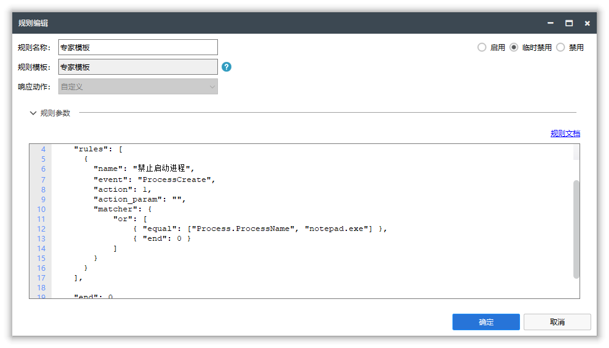

## iDefender

**冰盾 - 主动防御系统**  【专业不流氓】是一款基于[iMonitorSDK](https://imonitorsdk.com/)实现，为专业人士打造的终端、主机主动防御系统。使用冰盾可以帮助您抵制流氓软件、保护电脑安全、提高工作效率。

## 功能特点

- 支持进程、文件、注册表、网络等多种事件的监控拦截
- 支持多种不同的规则匹配，使用模板 + 参数的方式，让规则编辑更加方便
- 使用匹配缓存，优化匹配速度，性能消耗低

## 使用场景

- 文档保护 - 防止勒索病毒
- 进程守护 - 防止进程被注入、结束
- 进程拦截 - 抵制流氓软件
- 主机安全 - 保护服务器不被入侵
- 联网控制 - 保护个人隐私
- 行为管理 - 安全上网
- 病毒拦截 - 云引擎自动拦截病毒
- 隐私保护 - 保护您的数据不被流氓软件偷偷上传

## 软件截图

## 版本说明

### 2.2.0.0

- 响应事件添加信任模式

- 添加白名单规则模板

- 规则模板添加默认参数支持

- 进程路径参数支持从进程列表快速获取

- 添加更多规则模板

  - 禁止加载驱动
  - 禁止加载动态库
  - 禁止打开进程
  - 禁止进程修改文件
  - 禁止进程读取注册表
  - 禁止进程修改注册表键
  - 禁止进程修改注册表值
  - 注册表保护

  <a href = "https://imonitorsdk.com/publish/iDefender.exe"> <button class="main-button"> 软件下载 </button></a>

### 2.1.0.0

- 添加监控快捷开关
- 添加允许开启只读文件监控
- 添加隐私保护规则模板

### 2.0.1.0

- 添加多语言支持
- 修复界面一些小问题

### 2.0.0.0

- 重构规则引擎的实现，使用更加高效简单、容易扩展
- 添加基于模板 + 参数的规则编辑模式
- 添加常见的内置模板
- 添加在线模板升级
- 添加驱动签名

  <a href = "https://imonitorsdk.com/publish/iDefender.exe"> <button class="main-button"> 软件下载 </button></a>

