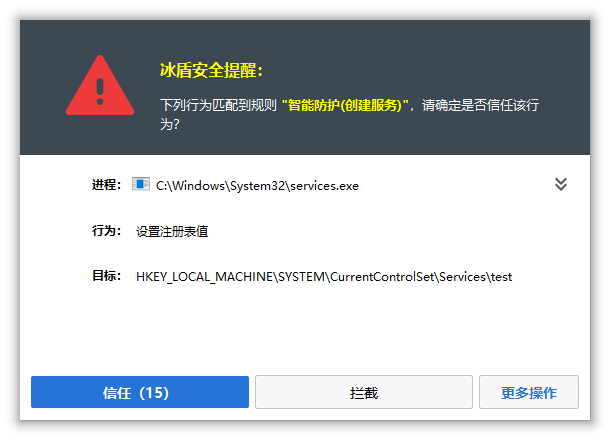
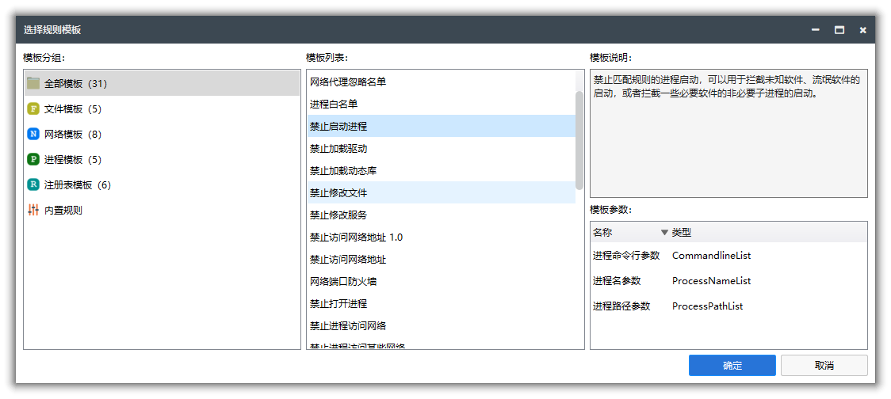

## iDefender

**冰盾 · 主动防御系统**  【专业不流氓】是一款基于[iMonitorSDK](https://imonitorsdk.com/)实现，为专业人士打造的终端、主机主动防御系统。使用冰盾可以帮助您拦截漏洞攻击、抵制流氓软件、保护电脑安全、提高工作效率。

## 功能特点

- 支持监控拦截多种事件，包括进程、文件、注册表、网络等。
- 内置智能防护、系统优化、安全加固、漏洞防御等默认规则，一键开启防护功能。
- 支持多种规则模板，可以快速添加规则，满足不同的防护需求。
- 占用系统资源低，兼容性好，适用于Win7到Win11以及Windows Server系统。

## 使用场景

- **文档保护：** 防止勒索病毒对您的重要文档进行加密，保护您的数据安全。
- **进程拦截：** 拦截流氓软件的恶意行为，保护您的计算机系统不受恶意软件的侵害。
- **主机安全：** 提供多层安全防护机制，保护服务器不受黑客攻击和恶意软件的入侵。
- **病毒拦截：** 通过云引擎自动拦截病毒，提供实时的病毒拦截和清除功能，保护您的计算机系统不受病毒和恶意软件的感染。
- **隐私保护：** 监控并防止流氓软件对您的个人隐私进行窃取和上传，保护您的数据不被非法获取和滥用。
- **联网控制：** 监控网络流量，防止个人信息泄露和网络攻击，保护您的个人隐私。
- **上网管理：** 通过对上网行为的管理和控制，保障您的网络安全，防止不良信息的侵害。
- **进程守护：** 防止恶意程序对进程进行注入和结束，保护系统稳定和安全。

## 软件截图

## 版本说明

### 2.5.0.0

**重大版本，建议更新**

- 优化内置的默认规则
  - 添加智能防护默认规则
  - 添加系统优化默认规则
  - 添加漏洞防御默认规则
  - 添加安全加固默认规则

- 模板支持自动在线更新
- 规则记录添加右键菜单
- 路径参数添加粘贴支持（方便快速录入多条数据）
- 路径参数添加多选删除
- 弹框添加进程命令行信息（方便查看脚本进程对应的脚本文件）
- 添加规则过滤
- 优化一些界面使用体验
- 修复一些问题

  <a href = "https://imonitorsdk.com/publish/iDefender.exe"> <button class="main-button"> 软件下载 </button></a>

### 2.4.1.0

主要是BUG修复，建议更新

- 修复规则列表“响应动作”下拉框没有自适应宽度覆盖到开启按钮的问题
- 修复规则市场更新通知极端情况可能导致没法正常启动的问题
- 添加无文件攻击默认规则

### 2.4.0.0

- 添加更多的响应动作支持（拦截、**弹框**、记录）
  - **添加拦截弹框交互支持**
  - 添加弹框信任列表
- **添加网络端口防火墙支持**
  - 可以拦截永恒之蓝漏洞等
- **添加导入默认规则**、规则导入、规则导出功能
- 优化规则列表界面
  - 支持Switch直接切换开启、关闭
  - 支持响应动作下拉框切换
  - 支持多选、del键删除
- 规则编辑界面支持添加规则说明
- 添加开机默认启动托盘（弹框需要托盘进程的支持）
- 拦截记录添加响应动作列（方便识别记录模式）
- 规则市场更新添加红点提醒
- 优化一些界面使用体验
- 修复一些问题

### 2.3.0.0

- 添加IPv6、ICMP拦截支持
- **网络拦截规则添加域名支持**
- **添加上网行为管理（HTTP拦截）支持**
- 添加HTTP请求自定义响应结果支持
- 添加规则分享支持
- **添加规则市场支持，可以通过规则市场直接下载其他人分享的规则**
- 添加自保护功能
- 添加家长控制（密码保护）功能
- 优化一些界面使用体验
- 修复一些问题

### 2.2.0.0

- 响应事件添加信任模式

- 添加白名单规则模板

- 规则模板添加默认参数支持

- 进程路径参数支持从进程列表快速获取

- 添加更多规则模板

  - 禁止加载驱动
  - 禁止加载动态库
  - 禁止打开进程
  - 禁止进程修改文件
  - 禁止进程读取注册表
  - 禁止进程修改注册表键
  - 禁止进程修改注册表值
  - 注册表保护

### 2.1.0.0

- 添加监控快捷开关
- 添加允许开启只读文件监控
- 添加隐私保护规则模板

### 2.0.1.0

- 添加多语言支持
- 修复界面一些小问题

### 2.0.0.0

- 重构规则引擎的实现，使用更加高效简单、容易扩展
- 添加基于模板 + 参数的规则编辑模式
- 添加常见的内置模板
- 添加在线模板升级
- 添加驱动签名

  <a href = "https://imonitorsdk.com/publish/iDefender.exe"> <button class="main-button"> 软件下载 </button></a>

