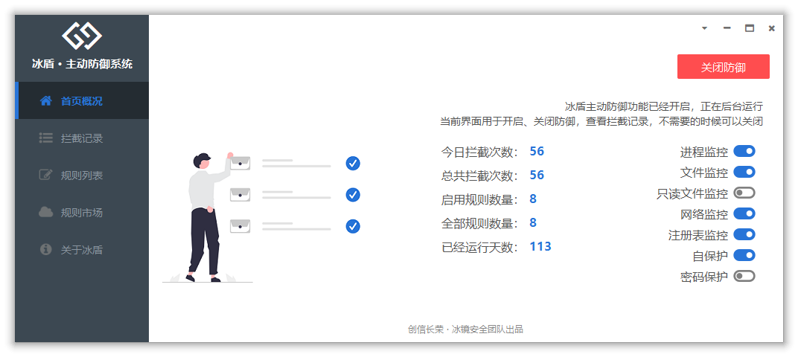
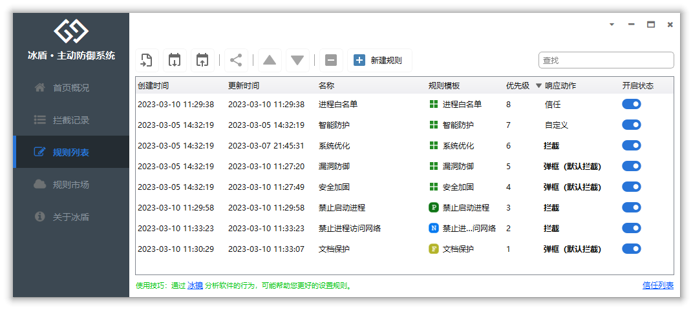
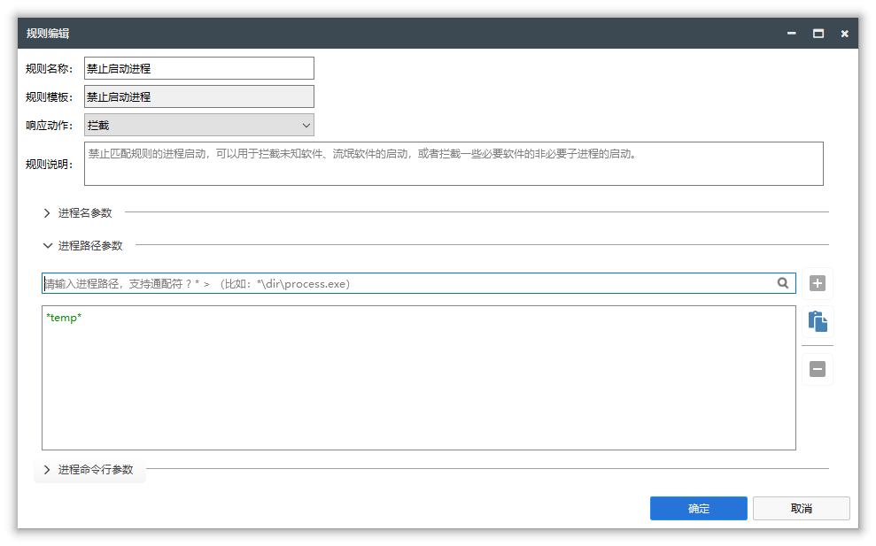
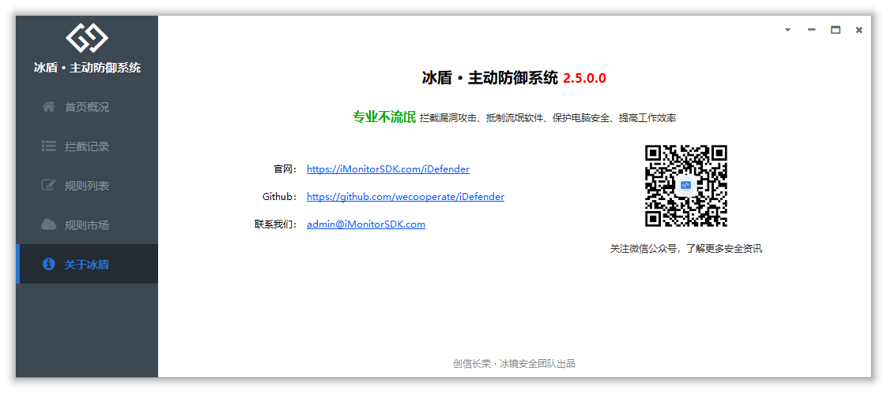

## iDefender

**冰盾 · 主动防御系统**  【专业不流氓】是一款基于[iMonitorSDK](https://imonitorsdk.com/)实现，为专业人士打造的终端、主机主动防御系统。使用冰盾可以帮助您拦截漏洞攻击、抵制流氓软件、保护电脑安全、提高工作效率。

## 功能特点

- 支持监控拦截多种事件，包括进程、文件、注册表、网络等。
- 内置智能防护、系统优化、安全加固、漏洞防御等默认规则，一键开启防护功能。
- 支持多种规则模板，可以快速添加规则，满足不同的防护需求。
- 占用系统资源低，兼容性好，适用于Win7到Win11以及Windows Server系统。

## 使用场景

- **文档保护：** 防止勒索病毒对您的重要文档进行加密，保护您的数据安全。
- **进程拦截：** 拦截流氓软件的恶意行为，保护您的计算机系统不受恶意软件的侵害。
- **主机安全：** 提供多层安全防护机制，保护服务器不受黑客攻击和恶意软件的入侵。
- **病毒拦截：** 通过云引擎自动拦截病毒，提供实时的病毒拦截和清除功能，保护您的计算机系统不受病毒和恶意软件的感染。
- **隐私保护：** 监控并防止流氓软件对您的个人隐私进行窃取和上传，保护您的数据不被非法获取和滥用。
- **联网控制：** 监控网络流量，防止个人信息泄露和网络攻击，保护您的个人隐私。
- **上网管理：** 通过对上网行为的管理和控制，保障您的网络安全，防止不良信息的侵害。
- **进程守护：** 防止恶意程序对进程进行注入和结束，保护系统稳定和安全。

## 软件截图

## 版本说明

### 2.8.0.0

重要版本，建议更新

- 更新iMonitorSDK到最新版本
  - 去掉没有文档化的AFD驱动监控，网络监控都使用WFP框架实现
  - 添加ICMP拦截支持
- 接入iFoundation冰塔快速开发框架
  - **支持模块化升级：少量的修改直接通过模块升级自动更新，不需要再频繁手动升级了**
  - 支持企业管理能力（企业管理后台会在3.0版本正式上线）
    - 支持统一管理
    - 支持策略下发
    - 支持功能扩展、定制、二次开发、系统集成

- 添加工具箱
  - 冰镜终端行为分析系统
  - 冰鉴软件行为分析系统
  - 冰云安全U盘
  - 冰刃进程强杀、文件强删

- 添加微信交流群（在关于冰盾页面可以获取二维码）
- 修复一些问题
  - 修复快速查找大小写敏感的问题
  - 修复导入规则的信任列表部分场景导入失败的问题
  - 修复信任列表多个规则匹配不生效的问题

- 优化其他一些使用体验

  <a href = "https://imonitorsdk.com/publish/iDefender.exe"> <button class="main-button"> 软件下载 </button></a>
  <h4 style="color:red">因为关闭了微软的遥测、广告功能，被Microsoft Defender误报成木马，已经联系处理，如果出现被其他安全软件拦截的情况，请自行信任。</h4>

### 2.7.0.0

添加易用性、稳定性，建议更新

- 更新SDK到最新的版本
  - 文件的读写添加首次事件通知
  - 过滤掉命名管道的读写请求
  - 规则引擎优化

- 去掉只读文件监控开关
  - 隐私保护换成读取文件、文件映射事件

- 导出规则、导入规则、分享规则添加信任列表的导出导入
- 优化开机启动的逻辑，添加注册表开机启动项
- 模板更新（支持经典模式：新建、修改、删除、读取等概念）
  - 添加全能模板
  - 添加进程行为模板
  - 添加文件行为模板
  - 添加注册表行为模板
  - 添加网络行为模板

- 其他
  - 修复数据库一些操作异常
  - 修复进程保护、进程操作拦截可能导致进程启动不了的问题
  - 修复一些误报问题
  - 修复对话框界面最大化状态的阴影问题
  - 规则引擎添加更多扩展属性

### 2.6.1.0

修复反馈的一些问题

- 拦截记录添加主动刷新按钮（支持F5刷新）
- 修复内核拦截事件（比如加载驱动）只能拦截，没法弹框的问题
- 修复禁止文件修改、禁止进程修改文件没法拦截通过文件重命名的方式覆盖文件的问题
- 修复部分特殊Win7启动卡慢的问题
- 优化弹框界面
  - 文件重命名支持显示重命名后的路径
  - 设置注册表值、删除注册表值支持显示注册表值的名称

### 2.6.0.0

增强稳定性、易用性，建议更新（感谢很多热心网友的建议）

- **添加学习模式**
  - 在学习模式下，只会旁路监控来学习、观察规则的使用和设置，实际不会拦截任何事件
  - 可以用这种方式来建立白名单
- 增强信任列表
  - 支持手动添加、编辑
  - 不是弹框拦截规则也支持添加信任
- 增强拦截记录交互
  - 支持右键添加信任的目标
- 优化性能
  - 优化系统启动过程的一些规则设置
  - 去掉规则引擎执行线程所有的文件操作
  - 优化UI线程被阻塞后，导致系统短暂卡死的问题
  - 修复一些场景导致启动卡住的问题
- 模板更新
  -  **添加快速模板（拦截模式）**
  -  **添加快速模板（信任模式）**
  - 添加拦截进程启动子进程模板
  - 添加忽略系统初始化过程的规则模板
  - 优化一些内置模板导致误报弹框的
- 其他
  - 调整模板更新逻辑
  - 修复启动到托盘闪一下界面的问题
  - 高级模板的一些字段命名做了中文翻译
  - 修复专家策略设置错误格式导致崩溃的问题
  - 修复进程路径选择的时候选择成进程名的问题
  - 优化自保护跟卡巴斯基冲突的问题
  - 优化一些使用体验问题

  <a href = "https://imonitorsdk.com/publish/iDefender.exe"> <button class="main-button"> 软件下载 </button></a>

### 2.5.3.0

- 安全加固添加文件加固、注册表加固选项
  - 支持MBR保护

- 修复导入初始化规则的时候RuleId重复的问题
- 日志去掉敏感信息

### 2.5.2.0

- 优化弹框
  - 文案调整：信任调整成允许
  - 添加启动进程的命令行参数显示

- 优化优先级匹配的流程
- 优化默认规则
  - 文档保护添加使用说明

- 优化托盘使用

### 2.5.1.0

- 调整弹框超时时间（从20秒调整到30秒）
- 弹框更多操作里面添加 **“结束当前进程”** 选项，更多操作的选项包括：
  - 结束当前进程
  - 信任进程 
  - 信任目标
  - 拦截进程
  - 拦截目标
  - 将当前进程加入白名单

- 更新iMonitorSDK到2.5.0版本

### 2.5.0.0

**重大版本，建议更新**

- 添加基础防护能力
  - **智能防护：** 利用智能分析和识别恶意软件行为，提供实时防护机制，确保系统免受恶意软件侵害
  - **系统优化：** 拦截非必要的软件和联网行为，提高系统运行速度和稳定性，提供更优秀的用户体验
  - **安全加固：** 拦截系统存在漏洞的组件和常见入侵途径，增强系统安全性，避免遭受恶意软件攻击
  - **漏洞防御：** 根据已知漏洞入侵方式开发专门的防御规则，保障系统不受黑客攻击和恶意软件入侵

- **模板支持自动在线更新** 
- 规则记录添加右键菜单
- 路径参数添加粘贴支持（方便快速录入多条数据）
- 路径参数添加多选删除
- 弹框添加进程命令行信息（方便查看脚本进程对应的脚本文件）
- 添加规则过滤
- 优化一些界面使用体验
- 修复一些问题

### 2.4.1.0

主要是BUG修复，建议更新

- 修复规则列表“响应动作”下拉框没有自适应宽度覆盖到开启按钮的问题
- 修复规则市场更新通知极端情况可能导致没法正常启动的问题
- 添加无文件攻击默认规则

### 2.4.0.0

- 添加更多的响应动作支持（拦截、**弹框**、记录）
  - **添加拦截弹框交互支持**
  - 添加弹框信任列表
- **添加网络端口防火墙支持**
  - 可以拦截永恒之蓝漏洞等
- **添加导入默认规则**、规则导入、规则导出功能
- 优化规则列表界面
  - 支持Switch直接切换开启、关闭
  - 支持响应动作下拉框切换
  - 支持多选、del键删除
- 规则编辑界面支持添加规则说明
- 添加开机默认启动托盘（弹框需要托盘进程的支持）
- 拦截记录添加响应动作列（方便识别记录模式）
- 规则市场更新添加红点提醒
- 优化一些界面使用体验
- 修复一些问题

### 2.3.0.0

- 添加IPv6、ICMP拦截支持
- **网络拦截规则添加域名支持**
- **添加上网行为管理（HTTP拦截）支持**
- 添加HTTP请求自定义响应结果支持
- 添加规则分享支持
- **添加规则市场支持，可以通过规则市场直接下载其他人分享的规则**
- 添加自保护功能
- 添加家长控制（密码保护）功能
- 优化一些界面使用体验
- 修复一些问题

### 2.2.0.0

- 响应事件添加信任模式

- 添加白名单规则模板

- 规则模板添加默认参数支持

- 进程路径参数支持从进程列表快速获取

- 添加更多规则模板

  - 禁止加载驱动
  - 禁止加载动态库
  - 禁止打开进程
  - 禁止进程修改文件
  - 禁止进程读取注册表
  - 禁止进程修改注册表键
  - 禁止进程修改注册表值
  - 注册表保护

### 2.1.0.0

- 添加监控快捷开关
- 添加允许开启只读文件监控
- 添加隐私保护规则模板

### 2.0.1.0

- 添加多语言支持
- 修复界面一些小问题

### 2.0.0.0

- 重构规则引擎的实现，使用更加高效简单、容易扩展
- 添加基于模板 + 参数的规则编辑模式
- 添加常见的内置模板
- 添加在线模板升级
- 添加驱动签名

  <a href = "https://imonitorsdk.com/publish/iDefender.exe"> <button class="main-button"> 软件下载 </button></a>

