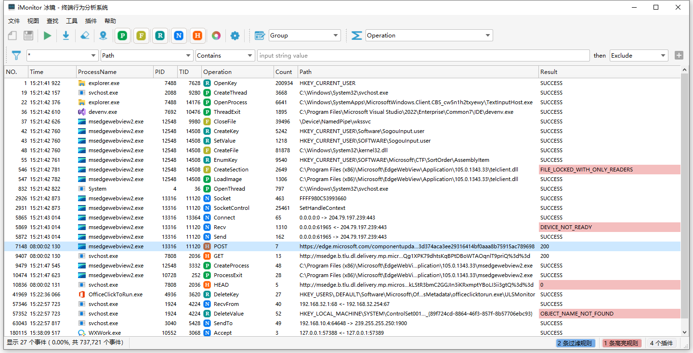
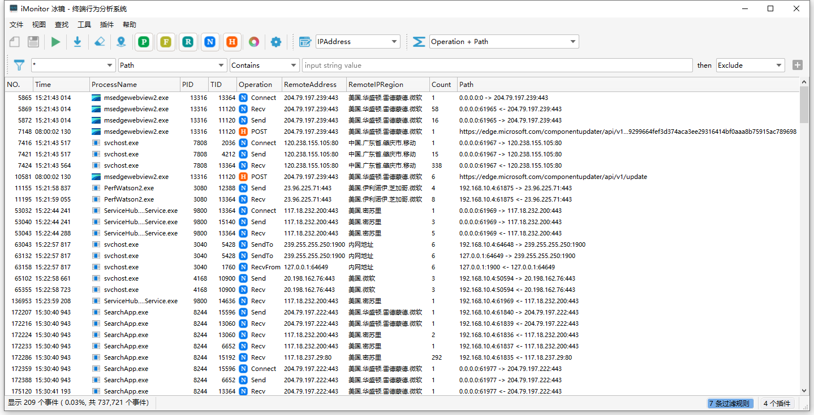
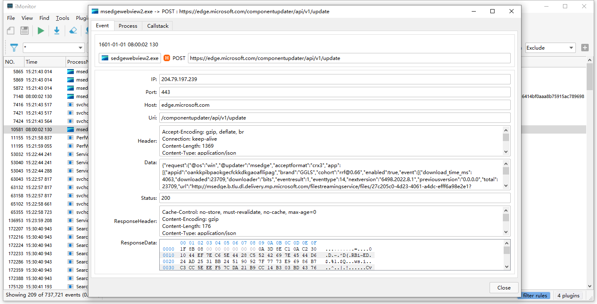
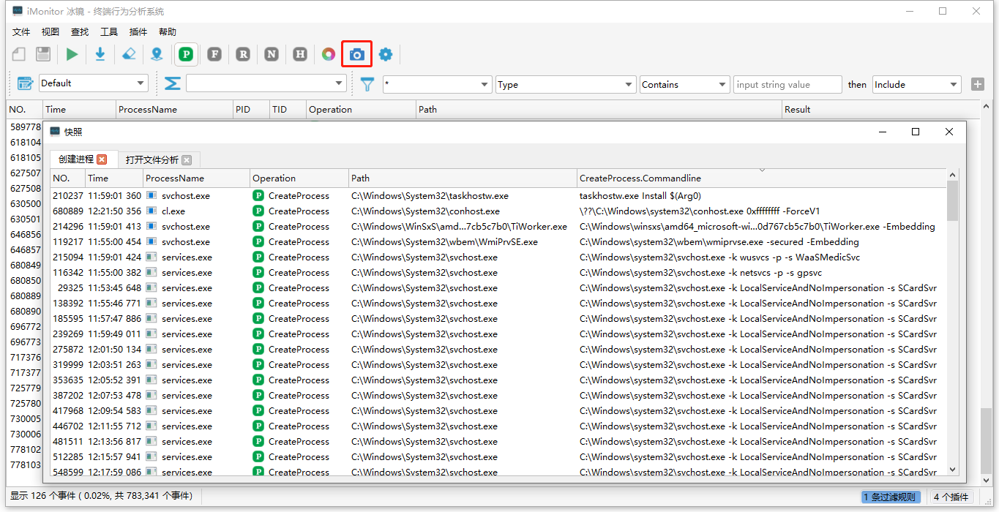
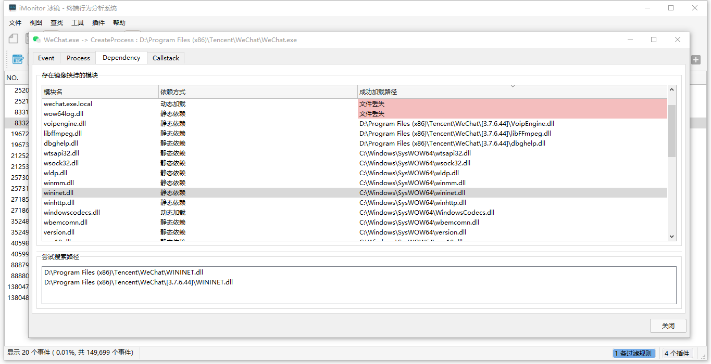
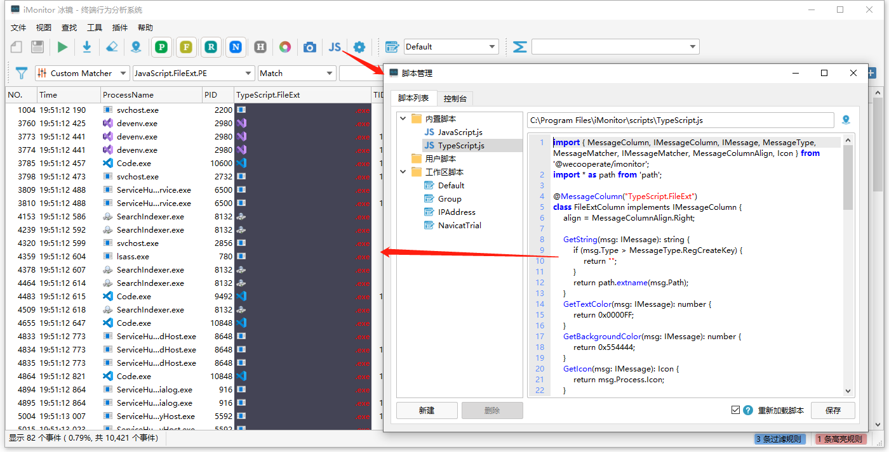
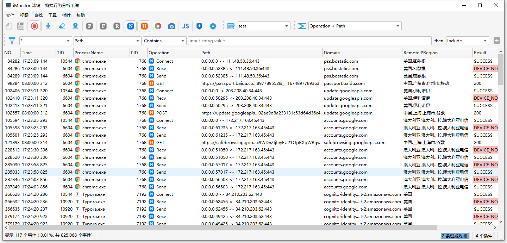

## iMonitor

iMonitor（冰镜 - 终端行为分析系统）【安全分析人员的必备工具】是一款基于[iMonitorSDK](/)的终端行为监控分析软件。

提供了对进程、文件、注册表、网络等系统行为的监控。支持扩展和脚本，可以轻易定制和添加更多功能。可以用于病毒分析、软件逆向、入侵检测，EDR等。

## 软件截图

## 更新说明
### 2.5.0

- **工作区添加联网共享工作区支持**
  - 可以从共享工作区下载到其他人分享的工作区，一键切换快速实现具体场景的分析

- 进程列表添加过滤全部子进程、远程注入的进程功能
- 优化一些使用细节

  <a href = "https://github.com/wecooperate/iMonitor"> <button> Github </button></a>
  <a href = "https://imonitorsdk.com/publish/iMonitor32.exe"> <button class="main-button"> 32位版本 </button></a>
  <a href = "https://imonitorsdk.com/publish/iMonitor64.exe"> <button class="main-button"> 64位版本 </button></a>

### 2.4.1

- 更新驱动到最新的版本
- 添加IPv6的DNS解析
- 修复一些问题

### 2.4.0

- 添加进程列表视图
- 修复一些体验问题

### 2.3.0

- 更新驱动到最新的版本
- 更新IP2Region地址库到最新的版本
- 添加IPv6网络监控支持
- 添加IP地址转换成域名显示（需要自定义列里面选择Domain）
- 修复HTTP监控端口冲突的问题

### 2.2.1

- 更新驱动到最新的版本
- Win7添加通过HCK认证的驱动，解决驱动无法正常加载的问题

### 2.2.0（2022.10.30）

- **添加脚本支持**（可以使用脚本来扩展列、自定义匹配器）详细参考[脚本开发指南](https://imonitorsdk.com/imonitor/script)
- 优化若干使用体验
- 修复一些小问题

### 2.1.1（2022.10.7）

- 调整分组跟过滤的优先级（之前是先分组后过滤，现在是先过滤后再分组）
- 修复选择列导致崩溃的问题

### 2.1（2022.10.5）

- 添加事件快照支持
  - 快照支持排序
- 添加动态库加载分析（属性 - Dependency）
  - 可以分析Dll丢失、Dll存在挟持风险
- 修复查找任意列导致的崩溃问题

感谢sagasm反馈的使用意见。

### 2.0（2022.09.14）

- 添加展示列的管理，可以定制需要显示的数据

- 添加高亮功能，可以对关键数据做高亮显示

- 支持分组合并统计 ，大大提高了分析的方便（类似于SQL中的GROUP BY效果)

- 添加工作区管理，不同的分析场景可以通过工作区快速切换

- 添加查找功能

- 添加多语言支持

- 添加更多事件支持

  - 添加对命名管道的支持
  - 添加HTTP、HTTPS的支持

- 添加插件支持

  - 支持自定义列
  - 支持自定义规则匹配
  - 支持界面交互（需要依赖Qt）

- 内置部分插件

  - 添加IP地址的归属地列
  - 添加可以自定义规则来显示的路径信息列
  - 添加进程敏感行为说明的列
  - 添加是否是文档的快速规则匹配

- 其他杂项

  - 添加丢弃掉被过滤规则的支持
  - 支持高亮规则跟过滤规则相互切换
  - 规则匹配添加增量过滤的方式，新增规则时不再需要全量匹配
  - 匹配规则添加正则表达式支持
  - 列、规则支持修改默认值
  - 添加安装包

### 1.0（2022.03.14）
首次开源版本

## 软件下载

  <a href = "https://github.com/wecooperate/iMonitor"> <button> Github </button></a>
  <a href = "https://imonitorsdk.com/publish/iMonitor32.exe"> <button class="main-button"> 32位版本 </button></a>
  <a href = "https://imonitorsdk.com/publish/iMonitor64.exe"> <button class="main-button"> 64位版本 </button></a>

