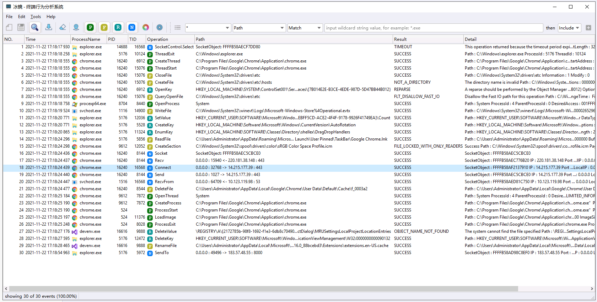
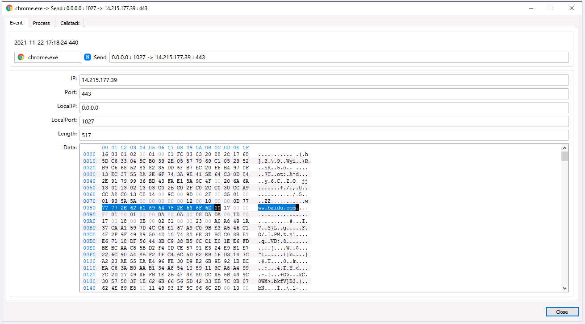
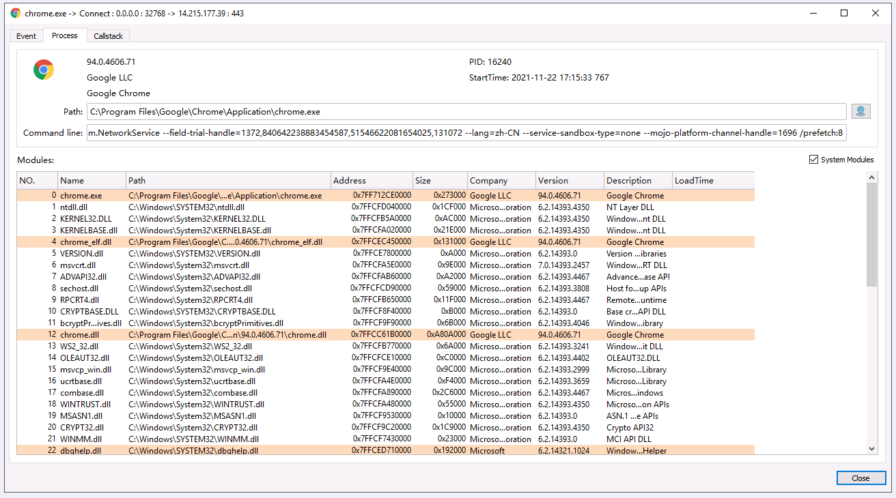
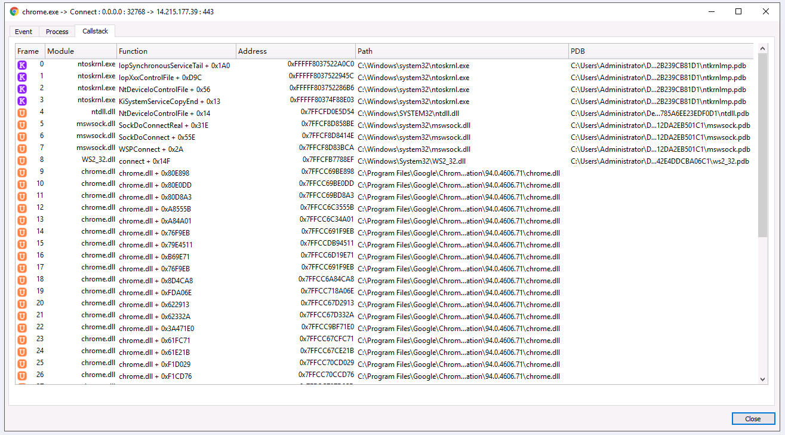
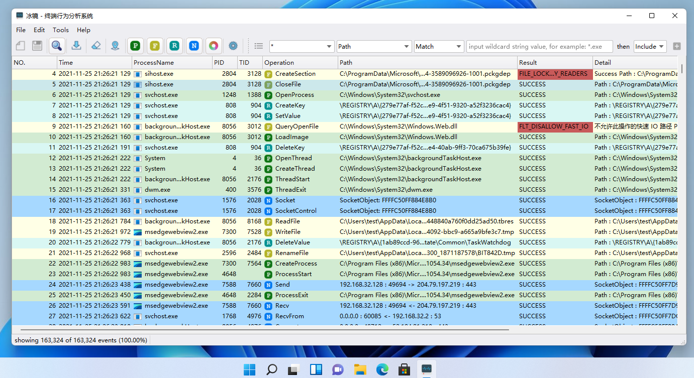

## iMonitor

iMonitor（冰镜 - 终端行为分析系统）是一款基于[iMonitorSDK](/)的开源终端行为监控分析软件。

提供了对进程、文件、注册表、网络等系统行为的监控。支持扩展和脚本，可以轻易定制和添加更多功能。可以用于病毒分析、软件逆向、入侵检测，EDR等。

## 软件截图

事件详情

Win11

  <a href = "https://github.com/wecooperate/iMonitor"> <button class="main-button"> 获取源码 </button></a>

