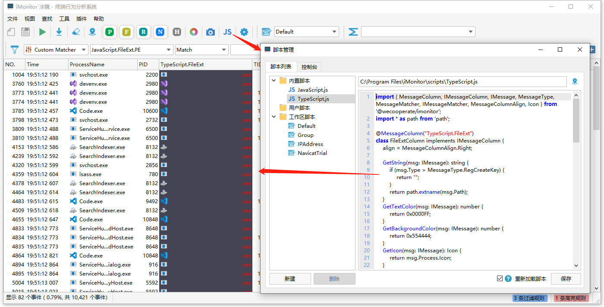

> 请先通过插件开发指南了解iMonitor的基本概念

 

## 脚本开发说明

iMonitor支持使用TypeScript、JavaScript来扩展能力。目前的版本（2.2）支持的扩展能力为

1. 添加显示列
2. 添加自定义匹配器

### 接口声明库

iMonitor的npm库为@wecooperate/imonitor

新建TypeScript项目后，通过下列命令安装：

```
npm i @wecooperate/imonitor
```

如果网络原因安装失败，可以从 https://www.npmjs.com/package/@wecooperate/imonitor 或者 https://github.com/wecooperate/iMonitor/tree/main/scripts/lib 手动下载。

### 快速开始

以TypeScript调用示例（建议使用TypeScript开发，可以有比较好的开发体验）

```typescript
import { MessageColumn, IMessageColumn, IMessage, MessageType, MessageMatcher, IMessageMatcher, MessageColumnAlign, Icon } from '@wecooperate/imonitor';
import * as path from 'path';

//
// 注册新的一列TypeScript.FileExt，可以在选择列的时候选择显示
//
@MessageColumn("TypeScript.FileExt")
class FileExtColumn implements IMessageColumn {
    align = MessageColumnAlign.Right;

    GetString(msg: IMessage): string {
        if (msg.Type > MessageType.RegCreateKey) {
            return "";
        }
        return path.extname(msg.Path);
    }
    GetTextColor(msg: IMessage): number {
        return 0x0000FF;
    }
    GetBackgroundColor(msg: IMessage): number {
        return 0x554444;
    }
    GetIcon(msg: IMessage): Icon {
        return msg.Process.Icon;
    }
}

//
// 注册新的自定义规则匹配，可以在过滤的时候选择Custom Filter来使用
//
@MessageMatcher("TypeScript.FileExt.PE")
class FileExtMatcher implements IMessageMatcher {
    IsMatch(msg: IMessage): boolean {
        if (msg.Type > MessageType.RegCreateKey) {
            return false;
        }
        let ext = path.extname(msg.Path).toLowerCase();
        return ext === '.exe' || ext === ".dll" || ext === ".sys";
    }
}
```

将上面的代码通过TypeScript的Playground功能，可以快速生成JavaScript代码。然后把生成的JavaScript代码粘贴到脚本区，重新加载就可以看到效果。

 [TypeScript Playground](https://www.typescriptlang.org/play?ssl=34&ssc=2&pln=1&pc=1#code/JYWwDg9gTgLgBAbzgWQKYGd0EMDmqDCEANgK4gB2ANHAJJqa4HFlW33Z7XuMAqAnmFRcMHVMiwwAxgAtUUanRGNxU2fJRK8hUhQCCRYDlY1JEcnAC+cAGZQIIOAHIAAgHdUpiIKgTUAelAzYBhoRwBuAFgAKFBIWDgAKjgsdDgwCWkbOwdHdJhpcOjo524tZgoACgAifkEAZUkoYDAYADoAMWAiVABRAA8YKoBKaMkiFNTO7v6YbRY4WO6QVHIYVMUGMp1zBGi4feSDIzgAXg1Npm39Q3JWgCVDaRhIqL2DgHFUGDqYJvIcCogdA4ABcbE0qCGYPQv2A-0QbwOB2A1jggOBrVqqDgAD5zqIsfdUDh8FBUL4ANKoPhDBFRJEMg5kmAkKDmKpVF6M-YWREM5ms8x5aStVADchYZbonCtAAKGSGXIOvPpHy+PDFs2I0GlYI2oihcHIZAARnI6dy4AK2XAAAx9W2O23tdpKnl8z4wABCWEkAGscHYSOQACbaHVA0Hgi6G40gM1QC3c63me0AVjTABZs5m3ZYPV8TGZddGDXrTDs+UiU3BI3K7JIRK0i+Q8yqVcVSmIJDI5NUsQ0mi0Ol1egM5T1hqNxpg4FMxzAVL3E4tUMtVusu0u1En9jR0NuS-rGIaTRBiOTK6rGSi0XWsbj8bwBKgiSSyZTqbTdtfLVavoKNhYEQ6CoHmSIqpa3TwJqpxpBkoripKqDSnKCqtCEAAyEDuFA+ApChipVkyAE2rBJwUU4iGoI4cAAD50XA5GUVUrQhkQRBVPRjHMWcrHoHw6Ccny7bREAA)

更多的示例可以参考 [https://github.com/wecooperate/iMonitor/tree/main/scripts/examples](https://github.com/wecooperate/iMonitor/tree/main/scripts/examples)。

## 接口说明

### IMessage

表示一个事件，因为字段比较多，这里不显示，详细看看 @wecooperate/imonitor 里面的声明文件。

IMessage也可以转换成特定事件来使用，比如

```typescript
if (msg.Type == MessageType.ProcessCreate) {
	let msgProcessCreate = msg as Message.ProcessCreate;
    let commandLine = msgProcessCreate.CommandLine;
}
```

### 添加一个列

> 列的名称可以重复，会使用最后一个注册的，建议使用比较长，有区别性的名字，比如 iMonitor.FilePath，避免被其他人覆盖。
>
> 原生的列也是可以被覆盖重新显示的，如果有定制显示需求，可以覆盖原生的列，但是强烈建议列的名称不要跟原生的列一致。
>
> 列可以自定义显示名称，如果列名比较长，可以自定义成其他的名称显示。

1. 继承实现IMessageColumn
2. 通过RegisterMessageColumn注册（如果使用typescript，可以用装饰器的方式 @MessageColumn）

```typescript
export interface IMessageColumn {
    align?: MessageColumnAlign;
    width?: number;
    description?: string;

    GetString(msg: IMessage): string;

    GetToolTips?(msg: IMessage): string;
    GetTextColor?(msg: IMessage): number;
    GetBackgroundColor?(msg: IMessage): number;
    GetIcon?(msg: IMessage): Icon;
}
```

| 成员               | 说明                                                         | 是否必须 |
| ------------------ | ------------------------------------------------------------ | -------- |
| GetString          | 返回列显示的字符串                                           | 是       |
| GetToolTips        | 返回鼠标hover到列显示的ToolTips                              | 否       |
| GetBackgroundColor | 返回列的背景颜色                                             | 否       |
| GetTextColor       | 返回列的文字颜色                                             | 否       |
| GetIcon            | 返回列的图标（Icon目前只支持获取进程Icon，未来会添加加载文件Icon） | 否       |
| align              | 列对齐方式（靠左、居中、靠右），默认靠左对齐                 | 否       |
| width              | 列初始化的宽度                                               |          |
| description        | 列信息描述说明                                               |          |

### 添加一个自定义规则匹配器


1. 继承实现IMessageMatcher
2. 通过RegisterMessageMatcher注册（如果使用typescript，可以用装饰器的方式 @MessageMatcher）

```typescript
export interface IMessageMatcher {
    description?: string;
    
    IsMatch(msg: IMessage): boolean;
}
```

| 成员        | 说明             | 是否必须 |
| ----------- | ---------------- | -------- |
| IsMatch     | 返回是否匹配     | 是       |
| description | 匹配器的描述说明 | 否       |

## 脚本类型

iMonitor的脚本分为下列类型：

- 内置脚本

  跟随安装包安装的脚本，会随着安装包更新而更新。

- 用户脚本

  使用者自己创建的脚本，重新安装后不会修改。可以创建多个脚本，所有的脚本在程序启动的时候加载。

- 工作区脚本

  每个工作区对应唯一一个脚本，在首次切换工作区的时候会加载。

## 使用注意！！！

1. 脚本的执行效率比C++的执行效率低几个等级，常规的列显示、实时列更新等是没有任何影响的，但是对于大量数据的过滤、排序操作，可能会消耗比较多的时间。

2. 目前内置可以直接使用的脚本库只有两个（path、@wecooperate/imonitor），需要其他库可以自行通过webpack打包进来。

   后续也会慢慢完善脚本的能力，提供更多的内置库支持，有需要的可以提需求。

## 脚本市场

正在建设中
