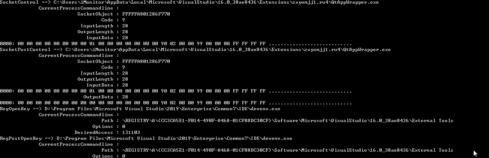
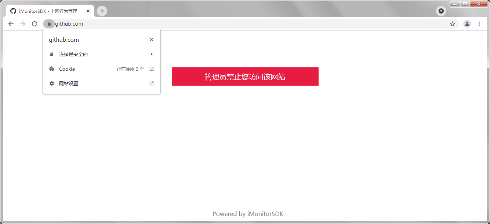

# 适用于如下的产品

-  主动防御
-  终端管控
-  入侵检测
-  主机安全
-  零信任
-  上网行为管理

# 快速入门

示例一：进程启动拦截实现

```cpp
class MonitorCallback : public IMonitorCallback
{
public:
	void OnCallback(IMonitorMessage* Message) override
	{
		if (Message->GetType() != emMSGProcessCreate)
			return;

		cxMSGProcessCreate* msg = (cxMSGProcessCreate*)Message;

		//
		// 禁止进程名 cmd.exe 的进程启动
		//

		if (msg->IsMatchPath(L"*\\cmd.exe"))
			msg->SetBlock();
	}
};

int main()
{
	MonitorManager manager;
	MonitorCallback callback;

	HRESULT hr = manager.Start(&callback);

	if (hr != S_OK) {
		printf("start failed = %08X\n", hr);
		return 0;
	}

	cxMSGUserSetMSGConfig config;
	config.Config[emMSGProcessCreate] = emMSGConfigSend;
	manager.InControl(config);

	WaitForExit("禁止进程名 cmd.exe 的进程启动");

	return 0;
}
```

示例二：sysmon

```cpp
class MonitorCallback : public IMonitorCallback
{
public:
	void OnCallback(IMonitorMessage* msg) override
	{
		printf("%S ==> %S\n", msg->GetTypeName(), msg->GetFormatedString(emMSGFieldCurrentProcessPath));

		for (ULONG i = emMSGFieldCurrentProcessCommandline; i < msg->GetFieldCount(); i++) {
			printf("\t%30S : %-30S\n", msg->GetFieldName(i), msg->GetFormatedString(i));
		}
	}
};

int main()
{
	MonitorManager manager;
	MonitorCallback callback;

	HRESULT hr = manager.Start(&callback);

	if (hr != S_OK) {
		printf("start failed = %08X\n", hr);
		return 0;
	}

	cxMSGUserSetMSGConfig config;
	for (int i = 0; i < emMSGMax; i++) {
		config.Config[i] = emMSGConfigPost;
	}
	manager.InControl(config);

	WaitForExit("");

	return 0;
}
```



示例三：上网行为管理（基于网络重定向的方式实现，支持https，详细参考http_access_control例子）



示例四：任意时刻对进程注入动态库

```cpp
class MonitorCallback : public IMonitorCallback
{
public:
	void OnCallback(IMonitorMessage* Message) override
	{
		if (Message->GetType() != emMSGImageLoad)
			return;

		cxMSGImageLoad* msg = (cxMSGImageLoad*)Message;

		if (!msg->IsMatchCurrentProcessName(L"notepad.exe"))
			return;

		if (msg->IsMatchPath(L"*\\kernel32.dll")) {
			msg->SetInjectDll(L"D:\\test.dll");
		}
	}
};

int main()
{
	MonitorManager manager;
	MonitorCallback callback;

	HRESULT hr = manager.Start(&callback);

	CheckSignError(hr);

	if (hr != S_OK) {
		printf("start failed = %08X\n", hr);
		return 1;
	}

	manager.InControl(cxMSGUserSetGlobalConfig());

	cxMSGUserSetMSGConfig config;
	config.Config[emMSGImageLoad] = emMSGConfigSend;
	manager.InControl(config);

	WaitForExit("模块注入：在notepad.exe启动加载kernel32.dll过程中，让其强制加载D:\\test.dll");

	return 0;
}
```

# 监控扩展

iMonitorSDK不仅仅提供了核心位置的监控，同时也提供了一整套的监控框架，基于这个框架，可以很简单的自己实现扩展的监控点。

比如进程启动的演示代码如下：

```c++
		do {
			cxProcessPtr process(ProcessId);

			if (!process)
				break;

			cxMSGProcessCreate msg;

			if (!msg.IsEnable())
				break;

			msg.ProcessId = process->m_ProcessId;
			msg.Path = process->m_Path;
			msg.Commandline = process->m_Commandline;
			msg.CreateTime = process->m_CreateTime;
            ...
			msg.Dispatch();

			if (msg.IsDeny()) {
				// Disable Process Create
			}
		}

根据IDL自动生成cxMSGProcessCreate对象，设置好cxMSGProcessCreate的各个字段后，调用Dispatch后就会跟应用层通信（根据应用层设置的配置，可以是同步，也可以是异步），如果是同步的，可以通过应用层设置回来Action，然后做出相应的反馈（比如禁止、注入、重定向等等）。
```


<div class = "md_footer" >
  <a href = "https://github.com/wecooperate/iMonitorSDK/tree/master/sample"> <button> 更多示例 </button></a>
  <a href = "https://github.com/wecooperate/iMonitorSDK"> <button class="main-button"> SDK 下载 </button></a>
</div>
